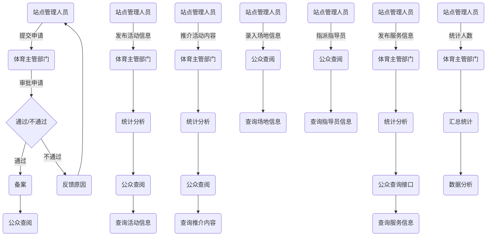

```mermaid
graph TD
    A1(站点管理人员) -->|提交申请| A2(体育主管部门)
    A2 -->|审批申请| A3{通过/不通过}
    A3 -->|通过| A4(备案)
    A3 -->|不通过| A5(反馈原因)
    A4 --> A6(公众查阅)
    A5 --> A1

    B1(站点管理人员) -->|发布活动信息| B2(体育主管部门)
    B2 --> B3(统计分析)
    B3 --> B4(公众查阅)
    B4 --> B5(查询活动信息)

    C1(站点管理人员) -->|推介活动内容| C2(体育主管部门)
    C2 --> C3(统计分析)
    C3 --> C4(公众查阅)
    C4 --> C5(查询推介内容)

    D1(站点管理人员) -->|发布服务信息| D2(体育主管部门)
    D2 --> D3(统计分析)
    D3 --> D4(公众查询接口)
    D4 --> D5(查询服务信息)

    E1(站点管理人员) -->|录入场地信息| E4(公众查阅)
    E4 --> E6(查询场地信息)

    F1(站点管理人员) -->|指派指导员| F4(公众查阅)
    F4 --> F6(查询指导员信息)

    G1(站点管理人员) -->|统计人数| G2(体育主管部门)
    G2 --> G3(汇总统计)
    G3 --> G4(数据分析)

```